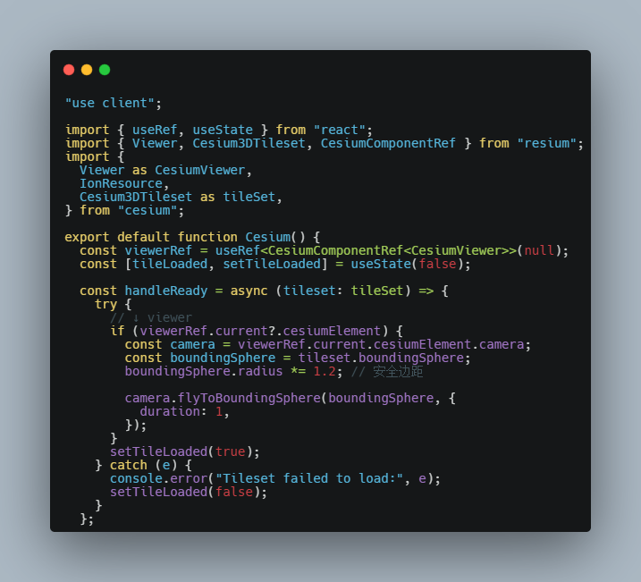

This is a [Next.js](https://nextjs.org) project bootstrapped with [`create-next-app`](https://nextjs.org/docs/app/api-reference/cli/create-next-app).

## Getting Started

First, run the development server:

```bash
npm run dev
# or
yarn dev
# or
pnpm dev
# or
bun dev
```

Open [http://localhost:3000](http://localhost:3000) with your browser to see the result.

You can start editing the page by modifying `app/page.tsx`. The page auto-updates as you edit the file.

This project uses [`next/font`](https://nextjs.org/docs/app/building-your-application/optimizing/fonts) to automatically optimize and load [Geist](https://vercel.com/font), a new font family for Vercel.

## Plan

### 📌 第一阶段：Cesium 3D 场景与模型加载基础（1 周）

🎯 目标：

熟悉 3D Tiles 和 glTF 模型的加载与控制

掌握摄像机视角控制和基础交互

✅ 重点任务：

使用 <Cesium3DTileset> 加载建筑模型（BIM/城市模型）

加载 glTF 模型并控制位置、姿态、动画（用 <Model> 组件）

使用 camera.flyToBoundingSphere, viewer.scene.pick 实现视角控制与点击拾取

### 📌 第二阶段：三维流场可视化实现（2-3 周）

🎯 目标：

实现基于三维坐标的流场可视化（如风场、烟流、水流）

掌握粒子系统的实现原理及优化技巧

✅ 实现路径一：基于 Canvas 绘制粒子系统（WebGL）

通过 Custom Primitive 实现 WebGL 渲染（如风场线流、粒子）

示例参考：

Cesium WindLayer

D3 风场模拟迁移到 Cesium 球面上

✅ 实现路径二：Three.js + Cesium 集成（高级）

用 Three.js 构建流场动画（如 Tube、点云）叠加在 Cesium 场景上

Cesium 的 viewer.scene.primitives.add(new ThreePrimitive(...))

### 📌 第三阶段：三维分析功能（2 周）

🎯 目标：

实现基础三维空间分析：剖面、通视、热力图等

✅ 推荐功能模块：

剖面分析：基于采样生成 PolylineGeometry 或贴图展示

通视分析：实现一个点对点通视工具，使用射线或地形遮挡判断

热力图体积可视化：用 box+颜色渐变或者 volume 渲染（推荐 CesiumJS + Shader）

### 📌 第四阶段：项目实战整合与性能优化（持续）

🎯 目标：

整合所有模块，构建一个三维可视化平台原型

实现图层切换、交互查询、场景管理

使用 requestRenderMode, viewer.scene.debugShowFramesPerSecond 优化性能

✅ UI 功能建议：

模型图层控制面板

实时风场切换面板（选择高度层、时间等）

模型信息弹窗、参数调整栏

## 记录

### 使用 Resium

1. 根据官网步骤引入，Next.js 项目需要使用 webpack。[入口](https://resium.reearth.io/installation#2-nextjs)

2. 样式引入个人认为不要使用标签式，而是使用 import 引入。

### 实现 3D Tiles 模型加载

1. Cesium3DTileset 加载模型，使用了[官方资源](https://sandcastle.cesium.com/)

2. 使用 <Cesium3DTileset> 组件，`onReady` 事件钩子调用的函数中，最好不要使用`viewer.zoomTo`函数，[zoomTo](http://cesium.xin/cesium/cn/Documentation1.72/Viewer.html?classFilter=viewer#zoomTo)需要等待多个数据源加载完毕才可调用，否则报错。



3. 启用全球地形

```tsx
import { createWorldTerrainAsync } from "cesium";
const terrainProvider = createWorldTerrainAsync();

return <Viewer full ref={viewerRef} terrainProvider={terrainProvider} />;
```

4. 模型样式、位置控制

```tsx
// 样式
tileset.style = new Cesium3DTileStyle({
  color: "color('blue', 0.6)",
  // color: {
  // conditions: [
  //   ["true", "color('blue', 0.6)"],
  //   ["${Height} >= 100", "color('blue')"],
  // ],
  // },
});
// 平移和旋转
const offset = Cartesian3.fromElements(0, 0, 30); // 经纬度、高度
// const angle = CesiumMath.toRadians(90); // 角度转弧度 Math as CesiumMath
// const rotationZ = Matrix3.fromRotationZ(angle);
// const offsetMatrix = Matrix4.fromRotationTranslation(rotationZ, offset);
const offsetMatrix = Matrix4.fromTranslation(offset);
tileset.root.transform = Matrix4.multiply(
  tileset.root.transform,
  offsetMatrix,
  new Matrix4()
);
// 模型中心位置（经纬度、高度）
// const lon = 0;
// const lat = 0;
// const height = 5000;
// const destination = Cartesian3.fromDegrees(lon, lat, height);
// const transform = Transforms.eastNorthUpToFixedFrame(destination);
// tileset.root.transform = transform;
```

### glTF 模型的加载与控制
